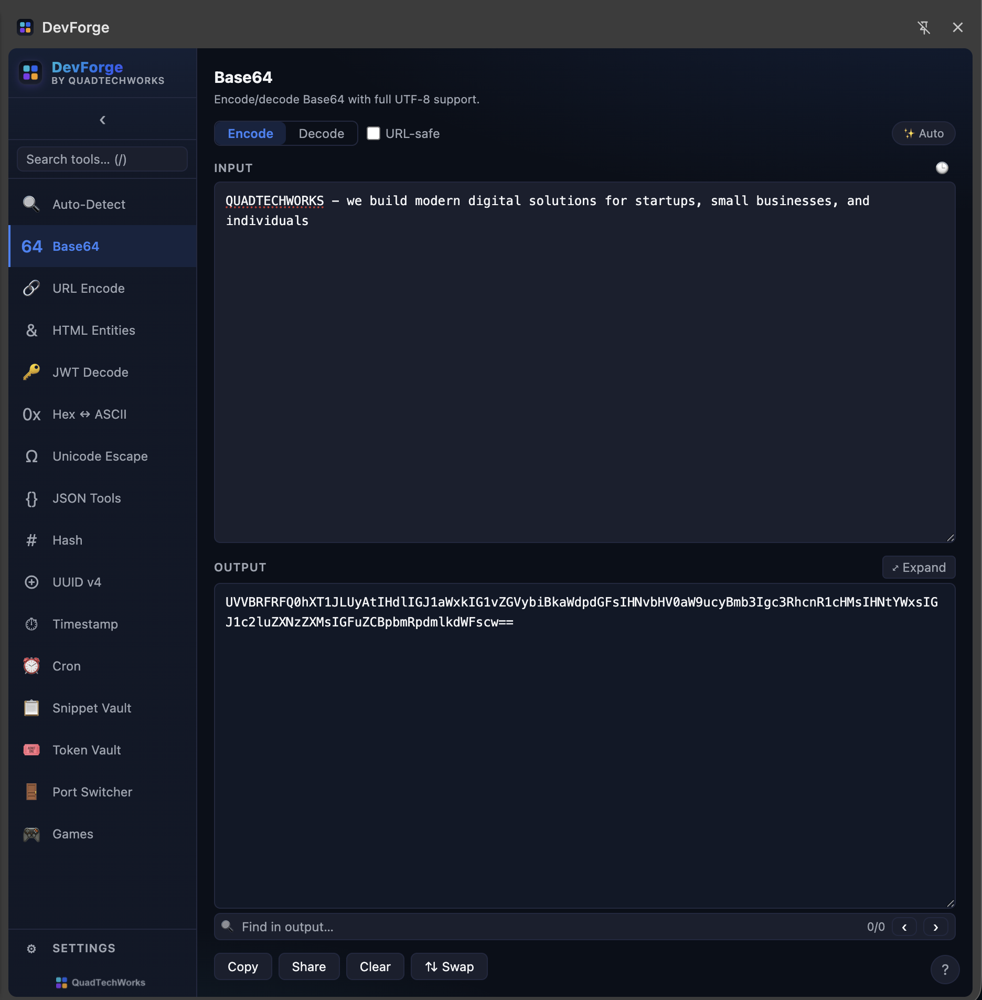

<div align="center">


# DevForge

**A Chrome side-panel developer toolkit — 16 tools, zero dependencies, no build step.**

_Encode/decode utilities · snippet & token vaults · localhost port switcher · a games break room._


<sub>Built by <strong><a href="https://quadtechworks.in">QuadTechWorks</a></strong></sub>

<br/>



</div>

---

DevForge lives in Chrome's **side panel**, so it stays open next to whatever you're working on. It's pure Manifest V3 + vanilla JavaScript — no bundler, no npm install, no frameworks. Clone it and load it.

## Contents

- [Install](#install)
- [Opening the panel](#opening-the-panel)
- [Tools](#tools)
- [Features](#features)
- [Workflow tools](#workflow-tools)
- [Games](#games)
- [Keyboard shortcuts](#keyboard-shortcuts)
- [Project structure](#project-structure)
- [Architecture](#architecture)
- [Contributing](#contributing)
- [License](#license)

## Install

```bash
git clone https://github.com/QuadTechWorks/devforge-extension.git
```

Then load it into Chrome:

1. Go to `chrome://extensions`
2. Enable **Developer mode** (top-right toggle)
3. Click **Load unpacked**
4. Select the cloned `devforge-extension` folder

The DevForge icon appears in your toolbar. To update later, `git pull` and click the refresh icon on the extension card.

> Works in any Chromium browser with side-panel + Manifest V3 support (Chrome 114+, Edge, Brave, Arc).

## Opening the panel

| Method | Action |
|--------|--------|
| Toolbar icon | Click the DevForge icon |
| Keyboard shortcut | `Ctrl+Shift+D` (Windows/Linux) · `Cmd+Shift+D` (Mac) |
| Omnibox | Type `dt <text>` in the address bar and press Enter |

The omnibox keyword `dt` runs Auto-Detect on the text and opens the panel with the result.

## Tools

| Tool | Description |
|------|-------------|
| **Auto-Detect** | Paste anything — identifies the format (JWT, base64, hex, JSON, URL, timestamp, Unicode) and decodes it |
| **Base64** | Encode/decode Base64 with UTF-8 support and URL-safe variant; **auto-detects** plain text vs Base64 and picks the Encode/Decode tab for you (`✨ Auto` toggle; any manual tab click turns it off) |
| **URL Encode** | Percent-encode or decode URL components (`encodeURIComponent`) |
| **HTML Entities** | Encode/decode `&amp;`, `&lt;`, `&#x27;`, etc. |
| **JWT Decode** | Split, base64url-decode, and pretty-print JWT header/payload; flags `exp` and `nbf` |
| **Hex ↔ ASCII** | Convert text to hex bytes or decode hex back to UTF-8; accepts spaces and `0x` prefixes |
| **Unicode Escape** | Convert between `\uNNNN` / `\xNN` escape sequences and plain text |
| **JSON Tools** | Prettify, minify, or escape JSON for embedding inside another JSON value |
| **Hash** | Compute MD5, SHA-1, SHA-256, SHA-512 hashes (live, on every keystroke) |
| **UUID v4** | Generate 1–100 cryptographically random UUIDs |
| **Timestamp** | Convert Unix timestamps (seconds or ms) to ISO dates and back; shows local + UTC |
| **Cron** | Parse 5- or 6-field cron expressions, describe them in plain English, list next 5 fire times |
| **Snippet Vault** | Saved text snippets with `{{placeholder}}` substitution, tags, search, and JSON import/export |
| **Token Vault** | Store JWTs grouped by environment; decode, track live expiry, copy as raw / Bearer / curl |
| **Port Switcher** | Jump between localhost dev ports; swap the current tab to another port on the same path |
| **Games** | Take a break — Snake, 2048, Memory, Simon, Slide, Lights Out, Tic-Tac-Toe |

## Features

- **Live updates** — output recalculates as you type (debounced).
- **Theme + palettes** — System / Light / Dark, plus a colour-palette picker in Settings: **QuadTechWorks** (default — sampled from quadtechworks.in: navy `#0b0f19` with a cyan→blue→violet brand gradient), Classic, Dracula, Sunset, Synthwave, Emerald, Ocean. Each is a gradient swatch that re-themes the whole app instantly.
- **Font size** — Small / Medium / Large for monospace areas.
- **Per-tool history** — last 10 inputs per tool via the 🕒 button (saved after 2 s idle); restore or delete entries.
- **File drop** — drag a file onto any input. Text loads as UTF-8, binary as base64 (5 MB cap).
- **Shareable links** — copy a self-contained `…/sidepanel.html#tool=base64&input=<base64url>` link that re-opens the tool with the same input.
- **Find in output** — a 🔍 find bar on Base64, JWT Decode, and Token Vault highlights matches (cyan; active match in violet) with an `n/m` count; `Enter` / `Shift+Enter` cycle and scroll to the match.
- **Expandable output** — the Base64 decoded box has an `⤢` expand toggle (plus native drag-resize).
- **State persistence** — last-used tool and per-tool input saved in `chrome.storage.local`.
- **Command palette** — `Cmd/Ctrl + K` to jump to any tool.
- **Data safety** — snippets/tokens/ports live under their own keys. "Clear all history" never touches them; a separate **Clear all stored data** button (type-`DELETE` confirm) wipes the vaults.
- **Resilient** — invalid input shows a friendly inline message; tools never throw or blank the UI.

## Workflow tools

### Snippet Vault

A keyed store of reusable text snippets — title, comma-separated tags, body. Two-pane layout: searchable list + editor that auto-saves on blur and after 1.5 s idle.

- **Placeholders** — write `{{name}}` in a body. The Render panel lists every placeholder with an input and shows live substituted output to copy. Names allow letters, digits, `_`, `.`, `-` (e.g. `{{db.host}}`). Empty values keep the literal `{{token}}`.
- **Tags** — free-form, comma-separated. Click a chip (or type `tag:kube`) to filter.
- **Import / export** — Export copies the whole vault as a JSON array of `{ id, title, tags, body, createdAt, updatedAt }`; Import replaces it from a matching `.json` (after confirmation).
- **File drop** — drop a text file onto the body to load it.

### Token Vault

A managed list of JWTs grouped by a free-form `env` (rendered as a colour chip whose hue is a stable hash of the env). Each row shows the label, env chip, and a live expiry indicator (✓ valid · ⚠ expiring within the hour · ✗ expired · — no `exp`), refreshed every 30 s.

- **Add** — paste a raw JWT (or drop a file containing one), optionally set an env. Label auto-fills from the payload's `sub` / `email` / `name`.
- **Detail** — decoded header + payload, editable label/env, notes, and three copy buttons: raw, `Authorization: Bearer <token>`, and `curl -H 'Authorization: Bearer <token>'`.
- Stored as `{ id, label, env, token, createdAt, notes }`. **Decoding is local only — tokens are never verified or sent anywhere.**

### Port Switcher

A grid of your common localhost dev ports, sorted ascending. Click a card (or **Open**) to launch `http://localhost:<port><path>` in a new tab.

- If the active tab is on `localhost`, a banner shows the current port, the matching card is highlighted, and **Swap to** redirects the current tab to the same path on another port.
- Add ports inline (port, label, optional path). Stored as `{ id, port, label, path }` (path defaults to `/`).
- Requires the **`tabs`** permission — used only to read the active tab's URL and open/redirect tabs. No page content is read or injected (justification is documented inline in `manifest.json`).

## Games

A break room with seven games. High scores persist locally and are independent of the data vaults; game loops and listeners tear themselves down when you switch tools.

| Game | Controls |
|------|----------|
| **Snake** | Arrow keys / WASD · `Space` to pause |
| **2048** | Arrow keys / WASD · `R` for new game |
| **Memory** | Click to flip — match all 8 pairs (tracks fewest moves) |
| **Simon** | Repeat the growing colour sequence (tracks best round) |
| **Slide** | 3×3 sliding puzzle — order tiles 1–8 in fewest moves |
| **Lights Out** | 5×5 grid — clicking toggles a cell + neighbours; turn them all off |
| **Tic-Tac-Toe** | You're X vs a simple AI; keeps a win/loss/draw tally |

## Keyboard shortcuts

| Shortcut | Action |
|----------|--------|
| `/` | Focus tool search (when not typing in an input) |
| `Cmd/Ctrl + K` | Open command palette (anywhere) |
| `Cmd/Ctrl + Enter` | Copy output |
| `Cmd/Ctrl + Shift + Backspace` | Clear input |
| `Cmd/Ctrl + Shift + S` | Swap input ↔ output (where supported) |
| `Esc` | Close overlay, or blur the current input |
| `?` | Toggle the keyboard cheatsheet |

## Project structure

```
devforge-extension/
├── manifest.json          # MV3 manifest (side panel, omnibox, tabs permission)
├── background.js          # service worker (omnibox + open-panel command)
├── sidepanel.html         # shell markup
├── sidepanel.css          # theme variables, palettes, all styling
├── sidepanel.js           # router, settings, history, file drop, share, palette
├── icons/                 # app icons (16–128) + QuadTechWorks wordmark
└── tools/
    ├── _jwt-util.js        # shared: JWT decode + expiry helpers
    ├── _find-util.js       # shared: find-in-output bar
    ├── md5.js              # shared: MD5 for the Hash tool
    ├── base64.js · url.js · html.js · jwt.js · hex.js · unicode.js
    ├── json.js · hash.js · uuid.js · timestamp.js · cron.js · autodetect.js
    ├── snippets.js · tokens.js · ports.js   # workflow vaults
    └── games.js            # the games break room
```

## Architecture

- **Tool module pattern.** Each tool is a global object:

  ```js
  window.ToolExample = {
    id: 'example',
    label: 'Example',
    icon: '🔧',
    description: '…',
    render(container) { /* build UI into container */ },
  };
  ```

  Tools are listed in `<script>` tags in `sidepanel.html` and registered in the `TOOLS` array in `sidepanel.js`, which builds the rail, command palette, and search from it.

- **Shell enhancement layer.** After a tool renders, `sidepanel.js` decorates any `textarea` whose `id` ends in `-input` with shared behaviours — per-tool history, file drop, and a Share button — so individual tools don't reimplement them. Managed-store tools (snippet/token/port vaults, games) opt out simply by not using that id suffix.
- **Storage.** Everything persists in `chrome.storage.local`: per-tool input as `tool_<id>_input`, history as `history:<id>`, settings as `settings`, vaults as `snippets` / `tokens` / `ports`, and game scores under `game_*`.
- **No build step.** It's plain ES — edit a file, reload the extension, done.

## Contributing

To add a tool:

1. Create `tools/<name>.js` exporting `window.Tool<Name>` with `{ id, label, icon, description, render(container) }`.
2. Add a `<script src="tools/<name>.js"></script>` line in `sidepanel.html` (before `sidepanel.js`).
3. Add `window.Tool<Name>` to the `TOOLS` array in `sidepanel.js`.
4. Reuse the existing CSS variables (`--bg`, `--accent`, `--text`, …) so your tool inherits theming and every palette.

There's no build or test harness — `node --check tools/<name>.js` is a quick syntax sanity check. Keep it vanilla (no dependencies).

See [`CHANGELOG.md`](CHANGELOG.md) for release history.

## License

Licensed under the **Apache License 2.0** — see [`LICENSE`](LICENSE) and [`NOTICE`](NOTICE).

You're free to use, modify, and distribute this software, including commercially, provided you retain the license and copyright notices and state significant changes. Apache 2.0 also includes an express patent grant. Contributions are accepted under the same license.

Copyright © 2026 [QuadTechWorks](https://quadtechworks.in).

---

<div align="center"><sub>DevForge — crafted by <a href="https://quadtechworks.in">QuadTechWorks</a></sub></div>
